# 🗺️ bsp-museum

Galeria navegável do acervo de mapas GoldSrc (Half-Life / CS 1.6). App desktop em **Tauri**:
aponta para a pasta `cstrike/maps`, e cada `.bsp` vira um card com **planta baixa renderizada**,
metadados e diagnóstico.

Uma pasta com 200 mapas é hoje 200 arquivos binários de nome sugestivo. Isto transforma o acervo
em algo que dá para olhar, filtrar e auditar.

```
┌──────────────────────────────────────────────────────────────┐
│ bsp-museum      [filtrar…] [modo ▾] [ordenar ▾] [pasta…]     │
├──────────────────────────────────────────────────────────────┤
│ ┌────────────┐  ┌────────────┐  ┌────────────┐               │
│ │ planta     │  │ planta     │  │ planta     │               │
│ │ baixa      │  │ baixa      │  │ baixa      │               │
│ ├────────────┤  ├────────────┤  ├────────────┤               │
│ │ bio_beach  │  │ de_dust2   │  │ zm_castle  │               │
│ │ zombie     │  │ de_ · bomba│  │ zombie     │               │
│ │ 32CT · 32T │  │ 16CT · 16T │  │ 20CT · 0T  │               │
│ │            │  │            │  │ ⚠ spawn de │               │
│ │            │  │            │  │  um time só│               │
│ └────────────┘  └────────────┘  └────────────┘               │
└──────────────────────────────────────────────────────────────┘
```

## Rodando

```bash
bun install
bun run app          # tauri dev
bun run app:build    # instaladores em src-tauri/target/release/bundle (NSIS/MSI, deb/AppImage, dmg)
```

Precisa de Rust (MSVC no Windows) e do WebView2 — que já vem no Windows 11. No Linux, as libs do Tauri
(`libwebkit2gtk-4.1-dev`, `libgtk-3-dev`, `libsoup-3.0-dev`, `librsvg2-dev`).

Na primeira execução, clique em **escolher pasta…** e aponte para a pasta com os `.bsp`
(subpastas incluídas). A escolha fica salva para a próxima abertura.

## Novidades da v0.6

> Capturas geradas pelo próprio app a partir de um mapa **sintético** (montado byte a byte nos
> testes — nenhum mapa da Valve no repositório). Para refazê-las: ver [Testes](#testes).

**Luz de verdade na vista 3D.** Os lightmaps do BSP viram um atlas e multiplicam a textura, como no
jogo. À esquerda com luz, à direita sem:

| com lightmaps | sem lightmaps |
|---|---|
| 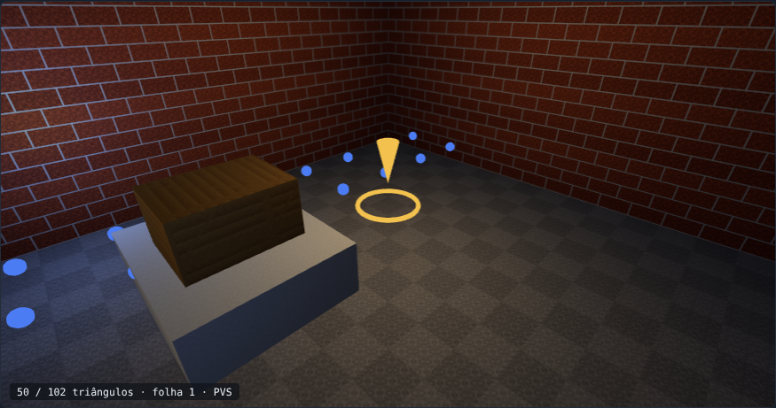 | 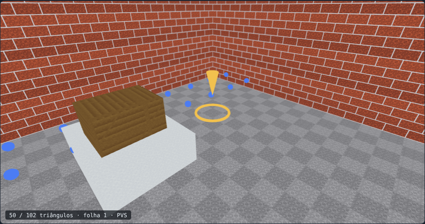 |

**Só desenha o que a câmera enxerga (PVS + frustum).** A árvore BSP localiza a folha da câmera, o
`vis` diz quais folhas ela vê, e a malha é dividida em pedaços (textura × célula do mapa) que o
frustum culling descarta. O contador no canto mostra triângulos desenhados / total
(`50 / 102` com PVS contra `88 / 102` sem). A montagem dos pedaços roda num Web Worker.

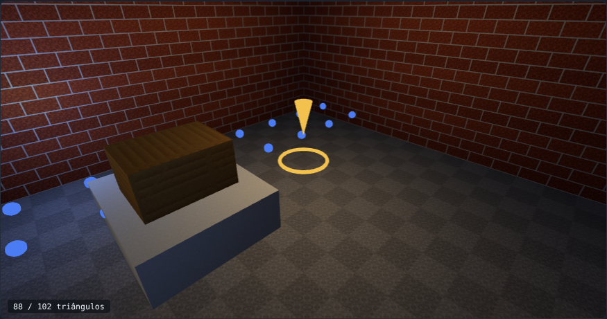

**Galeria com filtros, favoritos, tags e notas.** Filtra por gravidade, por regra do diagnóstico, por
tag e por favoritos; anotações ficam no `settings.json` (chave = nome do arquivo, então sobrevivem a
mover o acervo). Tema claro/escuro e interface em português/inglês (botões no topo).

| pt · escuro | en · claro · filtrando "crítico" |
|---|---|
| 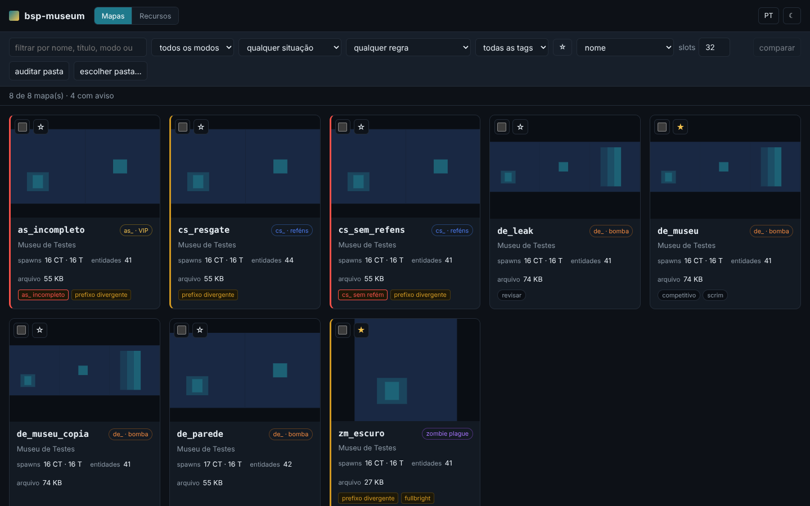 | 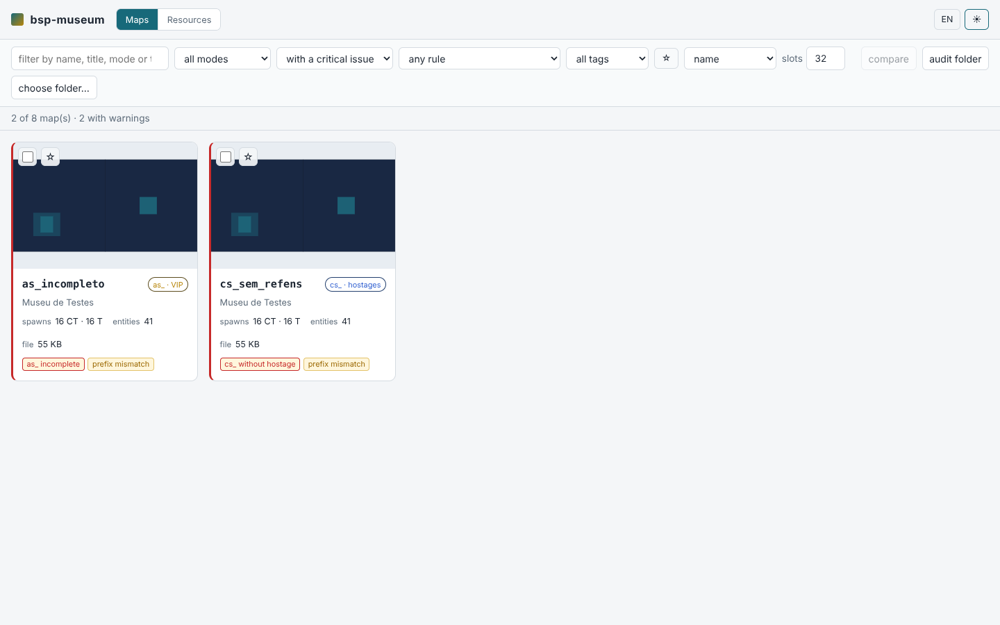 |

**Auditoria da pasta.** Roda o diagnóstico completo em todos os mapas (em paralelo), aponta arquivos
duplicados (mesmo conteúdo, nomes diferentes) e exporta Markdown, CSV ou HTML.

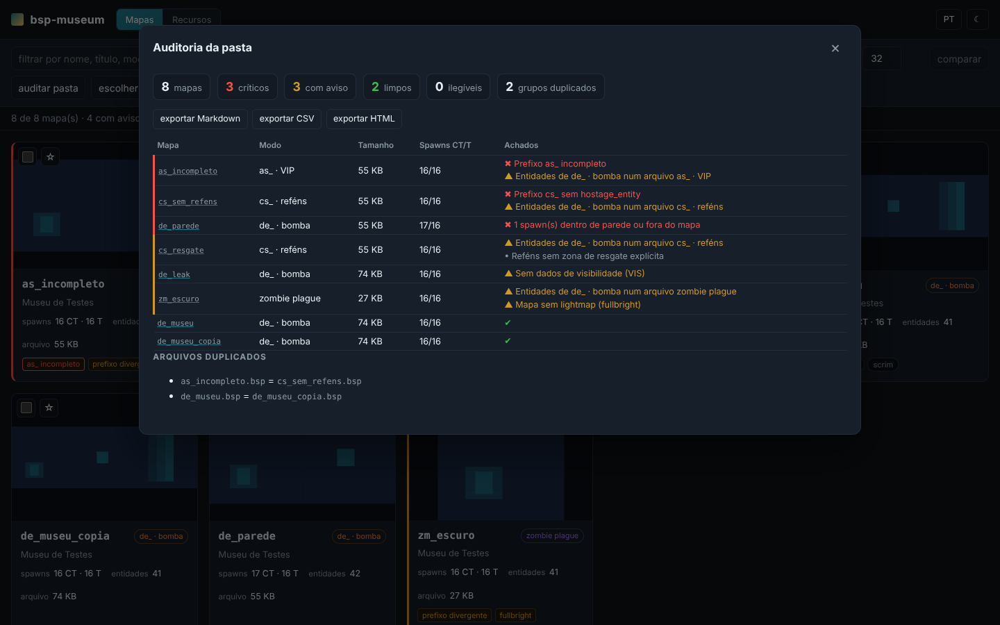

**Comparar dois mapas** (marque dois cards): diferença de lumps, entidades, texturas, WADs e quais
problemas sumiram ou surgiram.

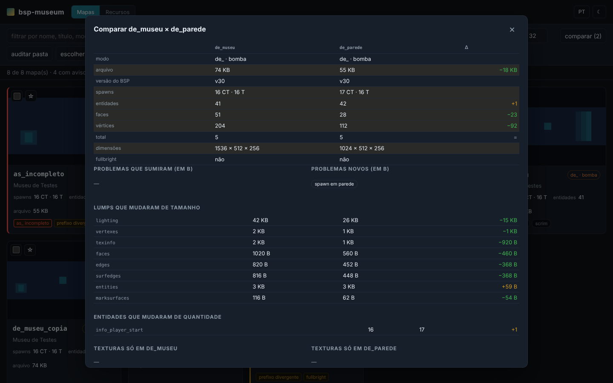

**Mais regras de diagnóstico** — `spawn-em-solido` (desce a árvore BSP com o ponto do spawn),
`sem-vis` (o VIS não roda em mapa vazado: é o sinal de *leak* que dá para ler do arquivo),
`limite-motor` (planos, folhas, vértices, faces, entidades… contra os tetos do HLCSG/engine, aviso
a 90 %), `textura-ausente`, `wad-nao-encontrado` e `recurso-ausente`.

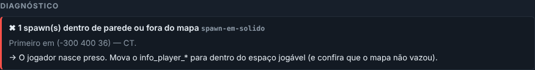

**Entidades clicáveis**: lista todas (com chaves/valores), busca por classe, nome ou valor e **leva a
câmera 3D até a entidade** (brush entities usam o centro do modelo).

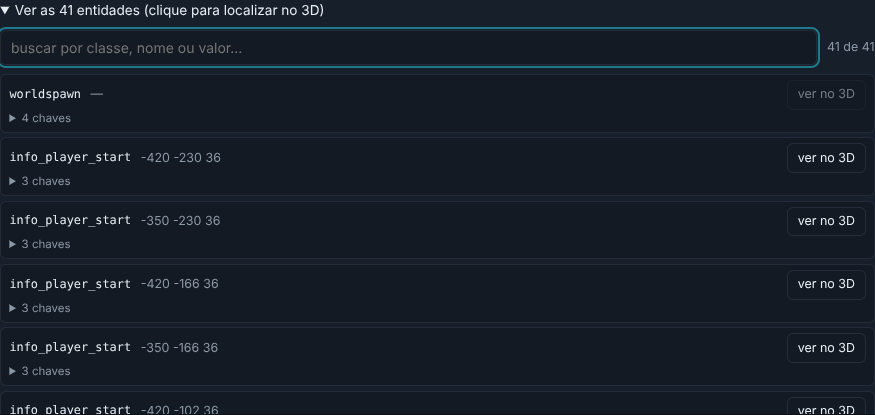

**Recursos necessários / FastDL**: lista mapa, `.res`, overview, WADs, céu, modelos, sprites e sons,
marca o que já vem no jogo base, soma o que o jogador baixa e exporta a lista (`.txt`).

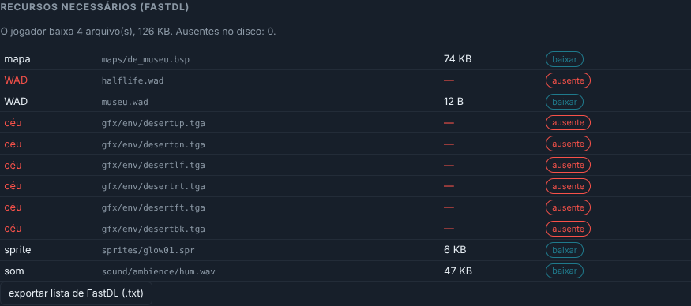

**Radar estilo CS**: vista de cima em verde; exporta `overviews/<mapa>.bmp`, `.png` e `.txt`.

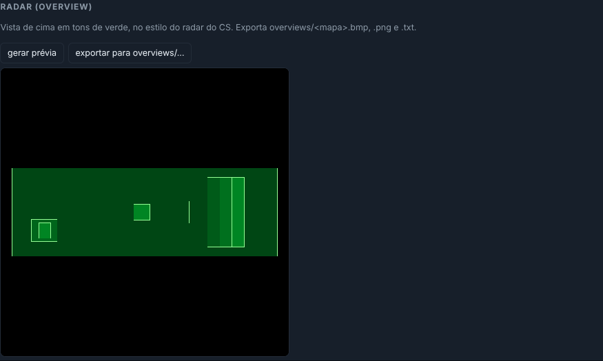

**Também**: animação de `.mdl` e troca de skin na aba Recursos (ver [Modelos](#modelos-mdl-props-e-o-visualizador-avulso)),
BSP do **Quake (v29)** abre (texturas em tons de cinza, lightmap monocromático), índice persistente
da varredura (reabrir uma pasta só relê o que mudou), varredura/auditoria/malha fora da thread da UI,
CI no GitHub Actions e instaladores para Windows, Linux e macOS.

## O que cada mapa mostra

**Planta baixa.** As faces viradas para cima são desenhadas do andar mais baixo para o mais alto,
com a **cor vindo da altura** (frio embaixo, quente em cima) — então uma passarela aparece por
cima da rua em vez de se perder na silhueta. Na vista detalhada, as paredes entram como traço
fino e os spawns como bolinhas (azul CT, laranja T).

**Vista 3D.** Cada mapa tem um viewport **WebGL** orbitável (arraste para girar, scroll para zoom).
Dois modos: *3D* mostra a geometria colorida por altura — você enxerga um *biowall* por cima, uma
passarela no ar, um teto que a planta escondia; *3D + texturas* aplica os **pixels reais** nas
faces: primeiro os embutidos no BSP, depois os dos **WADs** que o mapa declara (ele abre os `.wad`
da pasta do mod e resolve pelo nome). O **céu** também vem de verdade: os 6 lados de `gfx/env`
pelo `skyname` do worldspawn. Quando nada disso existe, entra uma cor neutra no lugar da textura.

Na vista 3D dá para: **tela cheia**, marcar **texturas transparentes** (respeita o alpha do mip), e ir
para **primeira pessoa (no-clip)** — você navega o mapa como no jogo: WASD anda, mouse olha,
Space/Ctrl sobe/desce, Shift corre, Esc sai. A vista é orbitável (arraste gire, scroll zoom).
Nos mapas `cs_` sem zona de resgate explícita (`func_/info_hostage_rescue`) o aviso é só informativo:
o GoldSrc resgata o refém perto de qualquer spawn de CT (fallback oficial).

### `de_dust2` no bsp-museum

Planta baixa (chão + paredes + spawns) e vista 3D (cor por altura) do mapa clássico,
geradas pelo próprio app a partir do `.bsp`:

| | |
|---|---|
| 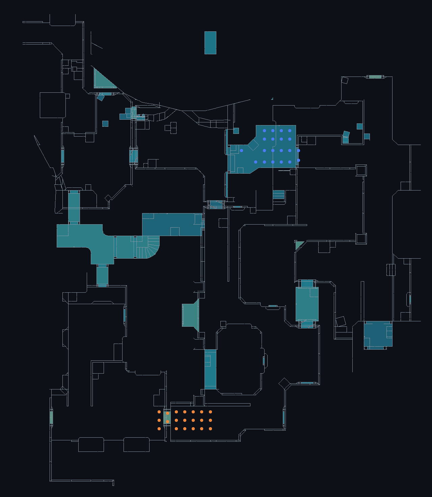 | 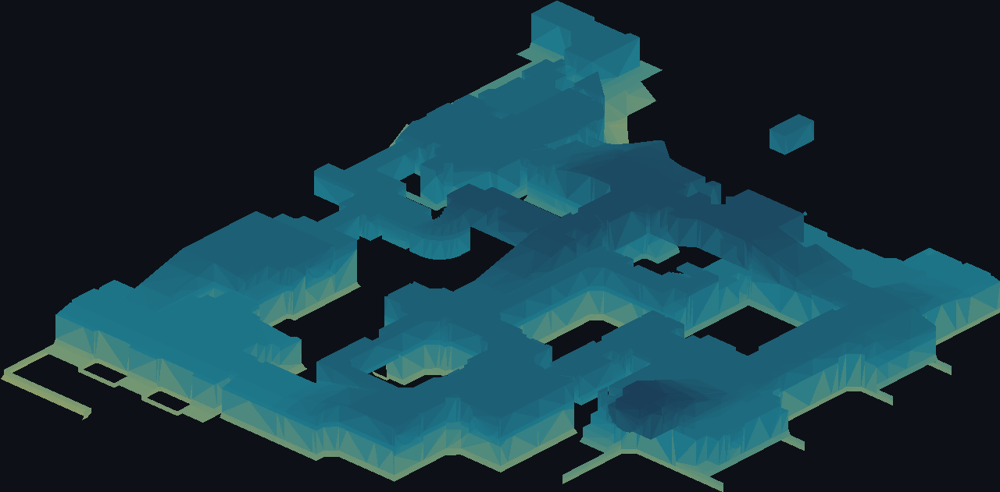 |

**Metadados.** Título do worldspawn, céu, WADs declarados, dimensões do mapa, contagem de faces,
vértices e brush entities, texturas usadas e quantas estão embutidas no BSP.

**O que pesa no arquivo.** Ranking dos lumps por tamanho. É como se descobre que o mapa tem 7 MB
por causa do lightmap, não da geometria.

**Diagnóstico.** As regras que decidem se o mapa realmente joga:

| id | severidade | pega |
|---|---|---|
| `de-sem-bomb-target` | crítico | prefixo `de_` sem alvo de bomba — o round nunca termina por objetivo |
| `cs-sem-refem` / `cs-sem-resgate` | crítico / info | `cs_` sem refém (crítico); refém sem `func_hostage_rescue` é só info — o GoldSrc resgata perto de any spawn CT |
| `as-incompleto` | crítico | `as_` sem `info_vip_start` ou sem `func_vip_safetyzone` |
| `prefixo-divergente` | aviso | as entidades montam um modo que o nome do arquivo não ativa |
| `sem-spawn` | crítico | nenhum `info_player_start`/`info_player_deathmatch` |
| `spawn-de-um-time-so` | crítico | só um dos times consegue entrar |
| `poucos-spawns` | aviso | menos spawns que slots do servidor → telefrag no início do round |
| `fullbright` | aviso | lump de iluminação vazio: faltou RAD ou houve leak |
| `sem-buyzone` | aviso | mapa competitivo sem `func_buyzone` |
| `wad-nao-declarado` | aviso | usa textura de WAD e o worldspawn não lista nenhum |
| `mapa-pesado` | info | acima de 8 MB, jogador desiste no download |

O número de slots usado em `poucos-spawns` é configurável (padrão 32).

Dá para **exportar a planta em SVG** — serve para post, para o site do servidor ou para anexar
num pedido de correção ao mapper.

## Arquitetura

```
src-tauri/src/
  bsp/reader.rs     cursor little-endian com limites checados (nada de panic em arquivo torto)
  bsp/mod.rs        header + lumps: vértices, arestas, surfedges, faces, texinfo (vecs), texturas; e a decodificação de pixels (mip0 + paleta -> PNG)
  bsp/entities.rs   parser do lump de texto + resumo (spawns, WADs, skyname, modo pelas entidades, instâncias de .mdl)
  bsp/palette.rs    paleta indexada (8bpp + 256 cores) -> RGBA, compartilhada por BSP/WAD/.mdl
  bsp/wad.rs        abre os `.wad`/`.mdl` declarados pelo mapa e resolve o pixel/arquivo por nome
  bsp/sky.rs        decodifica os 6 lados do céu (TGA/BMP de gfx/env) e monta a caixa do skybox
  bsp/render.rs     planta baixa em SVG                    ← puro, sem I/O
  bsp/light.rs      atlas de lightmaps + uv por vértice    ← puro
  bsp/tree.rs       ponto -> folha da árvore BSP (spawn em sólido)
  diagnostics.rs    regras: entidades (varredura), BSP/limites, disco (WAD/modelos/sons)
  resources.rs      o que o mapa precisa (FastDL), `.res`, sky, modelos, sons
  audit.rs          diagnóstico da pasta inteira + duplicados por hash
  compare.rs        comparação lado a lado de dois mapas
  entity_list.rs    entidades com posição para o painel clicável
  radar.rs          radar verde (PNG/BMP + overview .txt)
  mdl/mod.rs        parser de modelo `.mdl` (GoldSrc studiomodel v10) — pose de repouso
  catalog.rs        varredura, diagnóstico, montagem do detalhe, da malha 3D e do visualizador avulso de .mdl
  main.rs           comandos Tauri, cache e settings
src/                frontend (Vite + TS puro)
  viewer3d.ts       cena Three.js: chunks, lightmap, PVS, frustum, foco em entidade
  lib/geometry.ts   malha -> chunks (puro; roda no Web Worker e nos testes)
  lib/pvs.ts        folha da câmera + faces visíveis (puro)
  lib/filters.ts    filtros/ordenação/anotações da galeria (puro)
  lib/report.ts     relatório de auditoria (MD/CSV/HTML) e lista de FastDL (puro)
  i18n.ts           pt/en (`lib/dict.ts`, `lib/findings-en.ts`)
  ui/               detalhe, comparação, auditoria, modal
  resources.ts      aba Recursos: barra de animação do .mdl
  model-viewer.ts   cena própria do .mdl (skinning na CPU)
```

Duas decisões que valem explicação:

**A varredura não lê o mapa inteiro.** Para montar o catálogo bastam o cabeçalho, o lump de
entidades e o modelo 0 — o resto é lido por `seek`. Sem isso, abrir uma pasta com 200 mapas
significaria ler ~1 GB do disco só para preencher os cards. A varredura ainda é paralelizada com
`std::thread::scope`, sem dependência externa.

**As miniaturas são preguiçosas e cacheadas.** O SVG só é gerado quando o card entra na tela
(`IntersectionObserver`) e é guardado em disco com chave `caminho + tamanho + mtime` — mapa
recompilado invalida sozinho.

## Sobre o formato

BSP versão 30 (GoldSrc). O parser trata o arquivo como binário hostil: todo acesso é checado e
vira `BspError` legível em vez de panic — mapa velho baixado de fórum tem lump torto com
frequência maior do que se imagina.

Textura com offset de pixel `0` vem de WAD externo; diferente de `0` está embutida no BSP. É essa
diferença que alimenta o aviso de WAD não declarado.

Faces com textura `aaatrigger`, `clip`, `null`, `origin`, `hint`, `skip` e `sky` são volumes
invisíveis e **não entram na planta** — sem esse filtro, o desenho vira um borrão de caixas de
clip.

O índice `255` da paleta de 256 cores só é buraco (transparência) em textura cujo nome começa com
`{` — grade, cerca, vidro (convenção herdada do Quake). Numa textura comum o `255` é só mais uma
cor: tratá-lo sempre como buraco furava pixels que não deveriam sumir. Modelo `.mdl` usa a mesma
paleta, mas decide a transparência por uma *flag* da textura (`STUDIO_NF_MASKED`), não pelo nome.

## Modelos `.mdl` (props e o visualizador avulso)

Entidade do BSP com `model` terminando em `.mdl` (`cycler`, `monster_generic`, itens/armas
posicionados à mão) entra na vista 3D do mapa junto com o brush — sem controle novo, o toggle
"texturizado" já existente liga tudo junto. Modelo referenciado que não existe no disco é ignorado
em silêncio; o mapa continua abrindo normalmente.

A aba **Recursos** (ao lado da galeria de mapas) navega as pastas do mod (`models/player`,
`models/weapons`, `models/`) e abre qualquer `.mdl` isolado — jogador, arma, prop — fora do
contexto de um mapa específico.

**Animação.** O backend decodifica `mstudioseqdesc`/`mstudioanim_t` (RLE por canal, como no SDK) e entrega
a pose de mundo de cada bone por quadro (`load_sequence`, sob demanda e com cache); o frontend interpola
entre quadros e faz o skinning na CPU. A aba Recursos tem seletor de sequência, tocar/pausar, quadro e
velocidade; sequências em `nome01.mdl` (grupo externo) são lidas da mesma pasta. **Skins**: as famílias
(`skinref`) aparecem num seletor quando há mais de uma. A composição de rotação segue `AngleQuaternion`
do SDK e é coberta por teste contra uma matriz de Euler independente; o `.mdl` de teste é sintético.

## Testes

```bash
cd src-tauri && cargo test && cargo clippy --all-targets -- -D warnings
bun run typecheck && bun test        # filtros, PVS, geometria, i18n (paridade pt/en), relatórios
```

Os BSPs de teste são **montados byte a byte no próprio teste**: dá para descrever exatamente um
chão quadrado, uma parede, um teto, um surfedge invertido ou um lump corrompido sem carregar
nenhum arquivo de 3 MB no repositório. Cobrem versão de outro engine, arquivo truncado, lump
apontando para fora, lump com tamanho não múltiplo do registro, lixo aleatório (não pode dar
panic), e cada regra do diagnóstico.

### Refazendo as capturas de tela

```bash
export FIXTURE_DIR=/tmp/museu
(cd src-tauri && cargo test gerar_dados_das_capturas -- --ignored)   # mapas sintéticos + JSON do backend
bun run build
node scripts/screenshots.mjs $FIXTURE_DIR prints                      # precisa de `playwright`
```

O frontend real roda no Chromium; só o `invoke` do Tauri é trocado por um simulador que devolve os
JSON gerados pelo backend em Rust (WebGL via SwiftShader).

## Limitações

- GoldSrc v30 e Quake v29. BSP2 e Source (`de_dust2` do CS:S) não abrem — e o app diz isso em vez de fingir.
  No v29 as texturas saem em tons de cinza (a paleta global do Quake não acompanha o mapa) e o lightmap é
  monocromático.
- A vista 3D mostra as texturas embutidas no BSP **e** as dos WADs, mas precisa que os `.wad`
  estejam na pasta do mod (mesma de onde o mapa foi aberto) e que o `skyname` exista em
  `gfx/env`. Sem isso, entra cor neutra / domo de reserva.
- `.mdl`: animação usa só o blend 0 de cada sequência, não aplica *bone controllers* e a regra de
  `motiontype` (zerar a translação do bone de movimento) foi escrita de memória do SDK, sem conferir contra
  um arquivo real; skin de time por *remap* (tinta de cima/baixo) não está implementada. Sprites (`.spr`)
  só entram na lista de recursos, não são desenhados.
- Props `.mdl` dentro do mapa continuam em pose de repouso.
- Só entram na vista 3D do mapa entidades com `model` **explícito** no BSP — armas/itens que o
  jogo injeta por conta própria (sem essa chave) não têm como ser resolvidos só com o que está no
  `.bsp`.
- A conferência de WAD olha só o índice de nomes do arquivo (`textura-ausente`), não valida os pixels.
- Radar: o `ZOOM` do `overviews/<mapa>.txt` é uma estimativa para o enquadramento gerado; o calibre exato
  no cliente do CS não foi conferido contra o jogo — ajuste à mão se o radar desalinhar.
- Lightmaps: só o estilo 0 (luz estática); estilos animados (piscar, pulsar) não são aplicados.
- O brilho do lightmap usa fator fixo 2× (convenção *overbright* do Quake); não há gama configurável.
- Limites do motor (`limite-motor`) são valores de referência do compilador/engine, não lidos do jogo.
- Atualização automática (`tauri-plugin-updater`) não está ligada: exige par de chaves de assinatura e um
  endpoint de publicação do mantenedor. Os instaladores saem pelo workflow `release.yml`.
